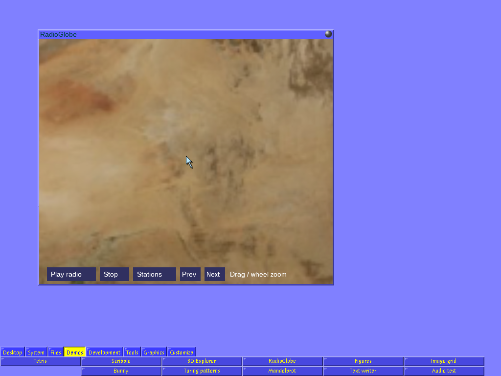

## Active Object System (AOS aka A2) git repository (from 9.12.2022)

An experimental native Apple Silicon desktop port is documented in
[RELEASE-DARWIN-AARCH64.md](RELEASE-DARWIN-AARCH64.md). It was developed with
substantial assistance from OpenAI Codex under the direction and testing of an
Active Oberon enthusiast; it is an independent preview, not an ETH release.

[Download the Apple Silicon readiness preview](https://github.com/Leimy/A2-Drawterm-MacOS/releases/tag/preview-2026-11-13-readiness),
including drawterm and the native compiler toolchain.

### Lightweight active objects on Apple Silicon

The opt-in lightweight runtime lets many Active Oberon objects share a worker
thread. Each activity keeps its own stack. When it parks in `AWAIT`, timed
sleep, or a supported TCP operation, the worker can run another activity.
CPU-bound loops in an `{ACTIVE}` body can also cooperate when compiled with
`--activityCheckpoints`.

**Try it in Terminal.** From the source checkout on an Apple Silicon Mac with
the Xcode command-line tools, point `A2_COMPILER_LIBRARY` at the extracted
preview's `toolchain` directory. If your checkout already has
`build/native-toolchain`, you can omit the first line.

```sh
export A2_COMPILER_LIBRARY="/path/to/A2-Darwin-arm64-preview/toolchain"
A2_ACTIVITY_WORKERS=1 scripts/test-a2-lightweight-activities.sh --do 'ConcurrentSieve.Run 1000'
```

The script builds a temporary runtime and runs the sieve without opening the
desktop. The sieve creates an ordinary active filter for each prime using
`NEW`. All 168 filters run on one worker and finish before the command returns.
[Sieve source](source/ConcurrentSieve.Mod)

**Try one tree on four pthreads (experimental).** In the same checkout and
with the same compiler setting, run:

```sh
scripts/test-a2-lightweight-activities.sh --do 'DarwinActivityTreeProbe.Run 4 1000'
```

The first argument requests workers and the second sets the sieve limit. The
probe calls the same `ConcurrentSieve.Run` as above. Expect 168 primes and
`Sieve workers used: 4`. In a native entry point, call
`ok := ActivityTrees.Run(app.Run, workers, used)` with a parameterless
procedure or bound method. Applications import `ActivityTrees`. The lightweight Darwin
build selects `Darwin.ActivityTrees.Mod` and this branch currently provides the
Apple Silicon implementation. The call joins the root and its ordinary active
descendants. Each new body is assigned round-robin and stays on its worker.
The runtime handles cross-worker `{EXCLUSIVE}` and `AWAIT`. Separate native
services have their own lifetimes. A trapped body cancels parked siblings;
CPU-bound code still needs to cooperate. Worker handoffs can cost more than
the work done by a small filter.
[Runtime](source/Darwin.ActivityTrees.Mod) · [Probe](tests/DarwinActivityTreeProbe.Mod)

**Use it in a desktop application.** RadioGlobe declares its watcher as
`StatusWatcher = OBJECT(ServiceActivities.DetachedObject)` and starts it with
`NEW(watcher, orbit)`. Its ordinary `BEGIN {ACTIVE}` body survives the return
from `Open`. The UI calls `watcher.Stop` when the window closes. The build
selects the shared worker on the lightweight desktop or an ordinary active
object on portable A2. To try the watcher, build the `desktop-lightweight`
target and open **Demos → RadioGlobe**. [Watcher source](source/WMRadioGlobe.Mod)
· [Desktop build and launch instructions](README-native-desktop.md#experimental-desktop-with-lightweight-activities)

### RadioGlobe on macOS

The native Apple Silicon desktop includes RadioGlobe, based on
[David Leimbach's 9front application](https://github.com/leimy/radioglobe), with
9,297 catalogue stations, globe markers, station search and native audio playback.
Open **Demos → RadioGlobe**; drag to rotate, use the wheel to zoom, and click a
marker to play. **Stations** opens the searchable catalogue. Playback supports
MP3, AAC/AAC+, Opus and native/Ogg FLAC, plus Ogg Vorbis.

[**Watch the RadioGlobe demo**](https://github.com/Leimy/A2-Drawterm-MacOS/releases/download/radioglobe-demo-2026-11-13/radioglobe-demo.mp4)
— 16 seconds, 60 fps capture, silent H.264 MP4, about 4 MB. The clip shows rotation, inertia,
station markers and zoom, recorded from A2's drawterm/9P framebuffer.

**Recording caveat:** This video illustrates the interface, not live performance.
It was recorded through a scripted test harness rather than an ordinary interactive
drawterm session. Its rotation and zoom timing—especially the stepped zoom in
and out—are not representative of using RadioGlobe directly. The 60 fps capture
rate should not be interpreted as an application performance measurement.

[](https://github.com/Leimy/A2-Drawterm-MacOS/releases/download/radioglobe-demo-2026-11-13/radioglobe-demo.mp4)

The current source build improves close zoom with **bilinear filtering written
in Active Oberon**, a **4096×2048 Earth texture**, and interpolated angle lookup
tables. The texture wraps across the longitude seam and clamps at the poles.
These captures show the same view and zoom before and after the change:

| Previous nearest-neighbor rendering | Filtered high-resolution rendering |
| --- | --- |
|  |  |

The larger texture uses about 32 MiB decoded. On the development Mac, sampled
full-quality deep-zoom frames in a 600×500 viewport took a median 58.5 ms,
compared with 35 ms before. Rotation retains the faster preview path and restores
full detail when motion stops. Filtering smooths magnification; detail remains
limited by the source image's resolution.

See [native build and desktop instructions](README-native-desktop.md) for building,
launching, controls and verification. The 2026-11-13 readiness preview includes
these changes; older preview downloads may not include them.

### SuperPET on macOS

The current source build includes **SuperPET**, a fork of the Programmer’s Editing
Tool with Acme-style mouse actions and structural editing. Open **Development →
SuperPET**. Right-click a module name to visit its source, or middle-click a command
in scratch text to run it. The **Edit** field applies expressions such as
`x/TODO/c/DONE/` to the current selection. See the [SuperPET guide](README-native-desktop.md#superpet)
for command arguments, examples, and supported editing operations.

In order to run A2 on your Windows- or Linux-based system, clone this repository and unzip the appropriate binary within the repository. Example (Linux, AMD64):
```
git clone https://gitlab.inf.ethz.ch/felixf/oberon.git
cd oberon
unzip Linux64
Linux64/a2.sh
```
Note that in order to keep size of the repository reasonable, we do not commmit binary files directly into the git repository. Instead, we use the large file storage (LFS) support of gitlab in order to keep these files out of local git storage of your computer. 

If you cannot or do not want to install LFS for git, you need to download the corresponding zip file from this gitlab website because then git is downloading only a stub of the files. You can identify this with file sizes: if the zip files in the root directory of this project are a few bytes small, then you do not have lfs installed.

Please inform me, if you need developer-access to the repository, if you observe missing files, or if you, in general, want to help setting this up.

## Active Object System (AOS aka A2) SVN repository (before 9.12.2022)

Unregistered users can download the A2 system from the repository located at https://svn-dept.inf.ethz.ch/svn/lecturers/a2/trunk using svn (read only access as user "infsvn.anonymous" using password "anonymous")

To checkout the trunk, use
<pre>
svn checkout --username infsvn.anonymous --password anonymous https://svn-dept.inf.ethz.ch/svn/lecturers/a2/trunk aos
</pre>

## Build Server

The previously existing build-server is being replaced by the CI/CD pipeline in this gitlab. Currently, the pipeline builds the binaries for each commit in a zip file. The zip-files comprise the most-recent binaries and can be downloaded from the pipeline artifacts. More tests will follow. 
